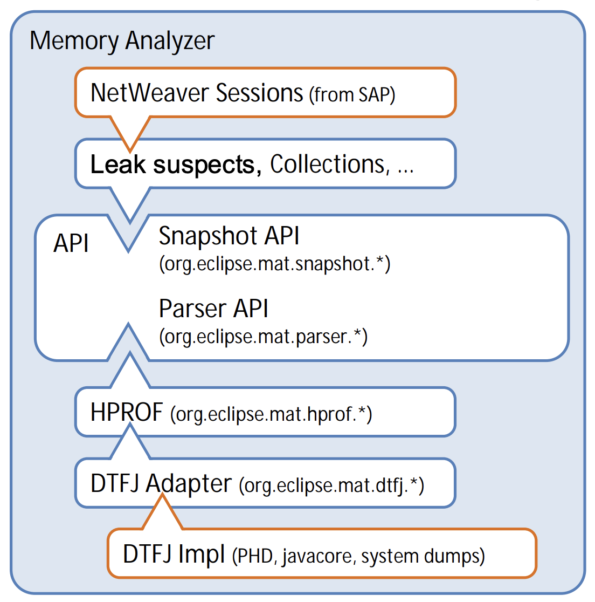

# Adding a new heapdump format to the Memory Analyzer

## Introduction

To add support for a new heap dump format to the Memory Analyzer, you will need
to create an Eclipse plug-in and use the provided extension points.

The HPROF and DTFJ plugins can be used as a reference if you do not know how
something can be done.

## API / Interfaces

The Memory Analyzer provides two major interfaces:

a. The Snapshot API provides access to the logical object graph inside the heap.
It enables inspections that analyze collections, identify leak suspects etc.

b. The Parser API makes reading the raw heap dump format pluggable. APIs conform
with Eclipse Quality Standards.



The complete [MAT API Reference](https://help.eclipse.org/latest/topic/org.eclipse.mat.ui.help/doc/index.html) is available online on the Eclipse help site.

## Overview

Basically there are two ways to extend the Memory Analyzer. One way is adding
features which operate on the heap dump. We call those "queries". All the
context menus like "Java Basics" and "Java Collections" etc. are implemented as
queries.

Queries can be found in these packages:

- `org.eclipse.mat.inspections.*`

The queries use the following API to implement their functionality:

- `org.eclipse.mat.snapshot.*`

- `org.eclipse.mat.snapshot.model.*`

The queries work like this: implement the `IQuery` interface and configure the
extension in the `plugin.xml`. To define input parameter, use the `@Argument`
annotation. Based on these annotations, we decided whether the query is shown
in a particular context menu.

The second way to extend MAT is by providing a heap dump reader. Currently
there are two supported formats: hprof and dtfj. The implementation can be
found in the two projects `org.eclipse.mat.hprof` and `org.eclipse.mat.dtfj`.
They implement the parser interface, which in turn in found in the
`org.eclipse.mat.parser` project.

In the case of HPROF, the "music plays" in the `HprofIndexBuilder` class. This
is called to initially build the indices (inbound, outbound object graphs etc.)
and then re-create the Java classes from the heap dump.

The second class is called `HprofHeapObjectReader` and is used to create
objects representing Java instances while doing the analysis - e.g. reading the
attributes, field values, etc.

## Relevant Extension Points

The relevant Eclipse framework extensions points for a new heap dump format
include: 

- the parser extension point (for parsing the new format)

- the trigger heap dump extension point (to enable the user to trigger a heap
dump from the VM with MAT)

When MAT reads a new heap dump, the parse method in the class
`SnapshotFactoryImpl` will be called. It handles the reading of a new heap dump
(new means that no indexes for this heap dump exist). This method calls the
index builder (provided by the parser extension point), a `SnapshotImplBuilder`
and the `GarbageCleaner`. The `GarbageCleaner` is used to purge unreachable
objects from the heap dump. The array returned by its clean methods can be used
to remove unreachable objects from the indexes. After the parse method is done,
MAT will have a `SnapshotImpl` for the heap dump, which contains the most
important information. 

### Parser extension point

Using the parser extension points requires you to provide implementations for
two interfaces..

#### `IIndexBuilder`

The index builder is responsible for reading the structural information of the
heap and building indexes out of it. This information is required to be able to
use MAT, so the `IndexBuilder` is the first thing you will need to get working. 

The main work that has to be done in the index builder consists of parsing your
new heap dump format and filling MAT's data structures. Your implementation of
the `IndexBuilder` will fill in the data into an `IIPreliminaryIndex`.
Implementations of this interface provide methods to fill the respective data
structures.

The data structures are: 

- Identifiers - This data structures holds the `long` addresses for all objects
present in the heap dump. ALL addresses must be contained and there must not be
duplicates. After collecting all addresses, `sort()` needs to be called on the
identifiers data structure. This will enable getting an `int` id for each
address by calling `reverse(address)` on the identifier. The id is necessary
for the other data structures. Negative numbers are not valid ids. If a
negative number is returned, a call to `sort()` may be missing or the address
is not present in the identifiers data structure. 

- ClassesById - Maps an id to a ClassImpl containing information about this
class. The comments in ClassImpl should prove sufficient to understand what is
going on. If you have questions about UsedHeapSize the [fourth post](http://www.eclipse.org/forums/index.php/mv/msg/163200/517929/#msg_517929) and [fifth post](http://www.eclipse.org/forums/index.php/mv/msg/163200/518191/#msg_518191) in the old forum may help you. 

- ObjectToId - Maps the id of an object to the id corresponding to the
`ClassImpl` of the object's class.

- gcRoots - Maps the id of a garbage collection root to information about the
garbage collection root (e.g. what type of root it is). It is very important
that you do not miss any roots because the `GarbageCleaner` will purge
unreachable objects from your dump and discard the information.

- array2size - maps an id of an object (not necessarily an array) to the size
of that object, in bytes. This data structure must contain an entry for every
array in your dump. It may contain an entry for a non-array object, if that
object's size differs from the instance size set in the corresponding
`ClassImpl` (this can be the case if Address-bashed hashing is used). 

- outbound - maps an id of an object to its outbound references. Similarly to
gcRoots, missing references may cause objects in your dump to appear as
unreachable. 

- thread2objects2roots - This is used to show garbage collection roots
associated with a thread. It is a hash map going from thread id to another hash
map. The second hash map maps all the object ids referenced by the thread to a
list of GC Root information for each object, holding the reason why the object
is referenced, such as a Java local variable, JNI Local, reference from a
native stack. The thread itself is the main GC root, and these maps are used to
annotate references from the thread. Objects referenced via a thread do not
need to be included in the gcRoots map unless they are also global GC roots.

- threads index file - This is used to show where the thread locals are in the
stack frames.  This is just a text file named `{prefix}.threads`.

##### Threads file format

The threads file format is multiple sections as follows:
```
Thread 0x7ffe04c1890

 at java.lang.Object.wait(JI)V (Native Method)
 at java.lang.Object.wait()V (Object.java:167)
 at org.eclipse.osgi.framework.eventmgr.EventManager$EventThread.getNextEvent()Lorg/eclipse/osgi/framework/eventmgr/EventManager$EventThread$Queued; (EventManager.java:397)
 at org.eclipse.osgi.framework.eventmgr.EventManager$EventThread.run()V (EventManager.java:333)

locals:
objecId=0x7ffe04c1890, line=0
objecId=0x7ffe04c1890, line=2
objecId=0x7ffe04c1890, line=2
objecId=0x7ffe04c1890, line=3
```

- "Thread" is matched to find the start of a section for a thread.

- The thread address is optional – but if omitted then none of the information
is stored for that thread.

- The stack frame data is just text, but should be in the same format as a Java
stack trace.

- A blank line ends the stack trace.

- "locals" starts the local variable information

- The line number in the stack trace (0-based) is matched by the decimal number
following the "line=".

- If the line number is found then the the object id is matched using the "0x"
and the "," comma to delimit the hex address of the object on the stack frame.

- A blank line ends the local variable section.

##### Index Constraints

There are some constraints on the indexes that must be met. For example, the
first outbound reference logged for each object must be to the object's class.
More information on these constraints can be found in [the thread](http://www.eclipse.org/forums/index.php?t=msg&th=163200&start=0&S=86b5235a33dd47bfed74cb351e531fbf)
in the old forum. Take care that the references for the objects in the dump are
correct because the `GarbageCleaner` will remove unreachable objects. If
unreachable objects should be kept, the "keep_unreachable_objects" can be set
(see HPROF or DTFJ for how this can be done).

Memory Analyzer 1.2 will be able to check indices for any parser. Either start
Memory Analyzer from inside Eclipse using the run configuration trace option: 

- org.eclipse.mat.parser debug enabled

or

- create a file `.options` containing

- `org.eclipse.mat.parser/debug=true`

- and start Memory Analyzer with the -debug option. See FAQ: How do I use the
debug tracing facilitiy.

#### `IObjectReader`

The object reader provides detailed information about objects, e.g. values of
instance fields. To do so, random access of the heap dump is needed. Luckily,
the developers of MAT provide the classes `BufferedRandomAccessInputStream` and `PositionInputStream`. They can be used like this: `new PositionInputStream(new BufferedRandomAccessInputStream(new RandomAccessFile(fileName)))` 

There are several kinds of Objects that the read method can return: 

- `InstanceImpl` for normal objects 

- `ClassloaderImpl` for classloaders 

- `ObjectArrayImpl` for non-primitive arrays

- `PrimitiveArrayImpl` for primitive arrays

The `<A> A getAddon(Class<A> addon);` method can be used to return extra
information specific to the heap dump type. It is also used to return objects
without an object ID, for example discarded and unindexed objects or
unreachable objects. MAT calls getAddon for the class `ObjectReference.class`.
The parser then returns an instance of a subclass of this class. MAT then fills
in the object address, and calls getObject, and the parser can then return an
object corresponding to the address, without needing an object ID for
`IObjectReader.read()`.

### The thread resolver extension point

It is possible to return extra information such as native thread stacks using
this extension point.

### The name resolver extension point

This perhaps could be used to return details of stack frames.

### The trigger heap dump extension point

TODO

## Methods as classes

The DTFJ parser has an experimental mode where stack frames are treated as
pseudo objects. This has the advantage that a Java thread refers to its stack
frames, and the stack frames refer to the locals, so it is easier to see where
a local is used.


```
Class Name                                                                                                           | Shallow Heap | Retained Heap
----------------------------------------------------------------------------------------------------------------------------------------------------
com.ibm.ws.util.ThreadPool$Worker @ 0x5db193e0  Default : 3 Thread                                                   |          136 |        11,740
|- <class> class com.ibm.ws.util.ThreadPool$Worker @ 0x57e82930                                                      |       13,245 |        13,421
|- <Java Stack Frame> com.ibm.io.async.AsyncLibrary.getCompletionData3([JIIJ)I @ 0x925dcd0  (AsyncLibrary.java:625)  |          256 |           256
|  |- <class> class com.ibm.io.async.AsyncLibrary.getCompletionData3([JIIJ)I @ 0x5404a1d0                            |            0 |             0
|  |- <Java Local> long[32] @ 0x5db1f460                                                                             |          272 |           272
|  '- Total: 2 entries                                                                                               |              |              
|- <Java Stack Frame> com.ibm.io.async.ResultHandler.runEventProcessingLoop(Z)V @ 0x925dd70  (ResultHandler.java:530)|          160 |         6,608
|- <Java Stack Frame> com.ibm.io.async.ResultHandler$2.run()V @ 0x925dd84  (ResultHandler.java:905)                  |           20 |            20
'- <Java Stack Frame> com.ibm.ws.util.ThreadPool$Worker.run()V @ 0x925dda4  (ThreadPool.java:1,550)                  |           32 |            32
----------------------------------------------------------------------------------------------------------------------------------------------------
```

So the stack frame object is of a type of the method, and the class hierarchy
is as follows:

```
Class                                                                                                                                |Type of Class
-------------------------------------------------------------------------------------------------------------------------------------|--------------------
<native memory>                                                                                                                      |<native memory type>
|- <method>                                                                                                                          |<method type>
|  |- sun.reflect.NativeMethodAccessorImpl.invoke0(Ljava/lang/reflect/Method;Ljava/lang/Object;[Ljava/lang/Object;)Ljava/lang/Object;|<method type>
|  |- java.lang.Thread.sleep(J)V                                                                                                     |<method type>
|  |- org.apache.axis2.jaxws.server.EndpointController.invokeOneWay(Lorg/apache/axis2/jaxws/server/EndpointInvocationContext;)V      |<method type>
'- <native memory type>                                                                                                              |<native memory type>
   '- <method type>                                                                                                                  |<native memory type>
-------------------------------------------------------------------------------------------------------------------------------------|----------
```

So `<native memory>` is a new type, with no superclass (a sibling to
`java.lang.Object`). Its class is `<native memory type>` not `java.lang.Class`.
`<method>` is a new type, of class `<method type>`.

## Other references

- [Forum posts](https://www.eclipse.org/forums/index.php/mv/msg/153571/486076/#msg_486076)
